There are many ways to achieve a result, but some ways can be used to make the
process easier.

Here is a collection of tips and tricks that can help you get the most out of
Agent Flow.

# Item 📦

Imagine a box: 📦

We will call the 📦 an item.

You can put whatever you want in the 📦 and move it around.

You can move a 4 digit pin code in it, the full archive of all Wikipedia
articles, or a shipping container full of chocolate bars.

This is how postal services work and is the basic idea of an item in Agent Flow.
You put it in, and we move it around.

## Item types 📚

It is beneficial to name the contents and put a picture of it on the box, so it
is easy to know what is inside without opening it.

All types of items can be represented as a short name for their type with a
picture representing the contents of the item.

Examples for the items mentioned above would be:

- pinNumber 🔢
- wikipediaArchive 📜
- chocolateContainer 🍫

Names will help us later, because specific jobs require specific items.

We can not deliver the wrong item for the job, and then expect to consistently
get the right result at the expected speed and quality from agents later down
the line.

_If those agents would be real life humans, they would be now converting the
items we delivered into actually useful ones, doing the thinking for us. In
short, we would be running an average company._

As our systems here are not intended to be self-babysitting, we need to make
correct decisions at the start, to make the system able to run on its own.

First step is to have the right items in the system, and to make sure they are
the right ones for the job they are intended for.

## Information encapsulation 🧠

Items are the entities that hold information and are moved around the system by
belts.

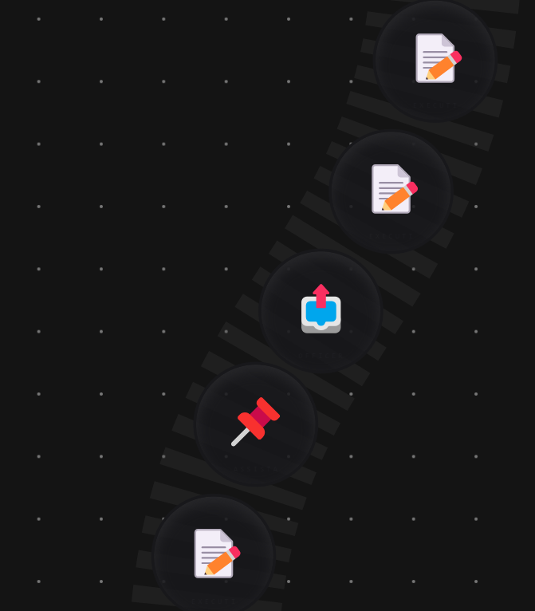

Information can be anything from a simple number like the temperature of a room,
to the full Wikipedia archive of every article ever written in all languages.

Obviously both extremes are useless when used in the wrong place at the wrong
time, which is what we need to keep in mind when making our items.

The key is to find the right balance and use the right amount of information at
the right time, so an agent can use it to perform its task, without being
overwhelmed, mislead or slowed down by all irrelevant data not needed for the
task at hand.

_Imagine a person explaining their complex relationship with their relative to
the doctor when doctor asked if they had the fever for more than 3 days..._

Note how delivering the perfect amount of information at the right time is as
important (or even more) as the agent's capability to process it, for the
expected quality of the result and the speed of achieving it.

This is a core tenet of Agent Flow's design philosophy: Garbage in, garbage out.
Make it obvious when something is wrong & make it easy to fix it.

## Item schema 🧬

Item schema is the description of the item's structure.

It is a set of rules that will describe precisely what the item must look like.

There is no room in the requested "temperature reading" history list of numbers,
to deliver your opinion of your relative's behavior, as it is not needed for the
agent to do its job, deciding if you have a fever or not.

## Summary

- Items are the building blocks of Agent Flow.
- They are moved around by belts.
- They encapsulate information.
- Inboxes and outboxes are the entry and exit points for items.
- When creating items we right-size the information for the job they are
  intended for.
- Schema is just a fancy name for "get to the point".

# Agent 🧑‍💼

Agents are the core building blocks of Agent Flow doing the actual work of
converting items of one type into items of another type.

## Agent 101

- take item from belt in inbox
- use the item to do some work (item disappears in the process)
- create a new item as a result of the work
- release new item on belt in outbox

## Agent types 🧠

Agent can be connected to a large language model, which is capable of processing
the information in the items received, and producing new items as a result of
this interaction.

This is not a rule, as agents can be also as simple as a filter software code,
which will decide where to direct the items it receives, or as advanced as
calling out to a real human to make a decision based on the information in the
item and produce the output items manually, because no machine can handle the
magnitude of the task at hand.

Agents can also call on APIs, databases, or other external systems to help them
do their job, this is usually wrapped in the software code but without the need
to call any LLMs or humans in the process.

The range of agents is wide, from the super smart, complex (and slow) human
agent, we can expect to wait for a long time - at one extreme - to the simplest
lightning fast 50% load balancer, distributing same amount of items it received
on the input to it's two outputs, in milliseconds - at the other.

They all do the identical thing: they take items in, process them, and put items
out.

## Agent schema 🧬

Agents should have a schema defined, which is a set of rules that will describe
precisely what the output item must look like.

Without a schema, any agent can generate any result, for which we can not be
sure if it will be useful later in the flow, when it is needed by the next
agent.

Next agent in the flow needs a specific shape of the items to be able to do its
job effectively, so we need to make sure that the agent upstream is producing
the items correctly - in other words, that it adheres to the schema.

Imagine a factory robot trying to put a car door on a can of tomato soup. Same
as the line worker trying to figure out where to bolt this bicycle wheel on the
mobile phone he is assembling.

The same issue applies here: Agent can not do the work if he got the wrong item.

Garbage in, garbage out.

# Belts 🏗️

Belts are the backbone of Agent Flow. They are used to move items from one place
to another, and they serve as the core observability tool in the system,
empowering you to see what is happening in your system from a bird's eye view,
allowing you to make informed decisions based on the data you see.

## Connection ports 🚪

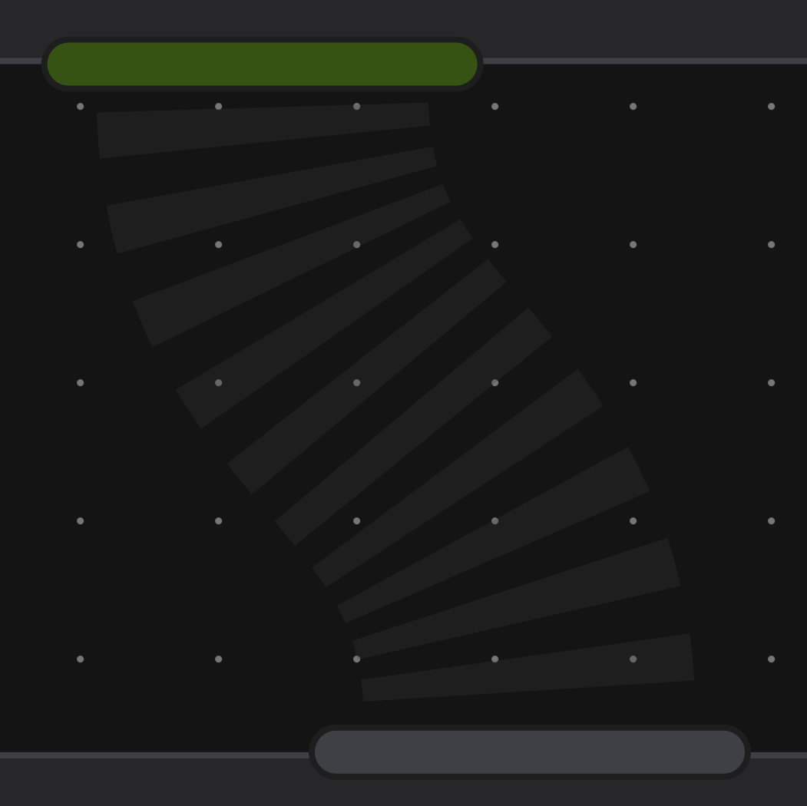

### Outbox 📤

Belts are connected to the wide bottom port of an entity producing items, this
is called the outbox port.

### Inbox 📥

Belts feed items into the wide top port of an entity consuming items, this is
called the inbox port.

### Direction 🔄

Belts automatically move items from the outbox to the inbox, also as indicated
by their animation.

## Creating a belt 🧵

When you connect the outbox of one entity to the inbox of another, a belt is
created. This is done with a mouse by drawing a line from the outbox to the
inbox port.

## Belt speed 🏎️

All belts in Agent Flow have the same speed. This means that they are easy to
compare and predict. You can always rely on the fact that a belt will move an
item from one end to the other in a fixed amount of time.

## Belt length 📏

The length of the belt is unlimited. This means that you can have as many items
on a belt as you want, and they will all move at the same speed.

A belt of twice the length will take twice as long for the item to travel from
one end to the other. This can be used to design simple delays in your system,
literally eyeballing the distance between the entities to create a delay of a
specific length.

### Hacking with belt length 🕵️‍♂️

Making a belt extremely short by putting the outbox and inbox of two entities
practically on top of each other can be (ab)used to create a delay of zero, as
the item will arrive at the inbox immediately after it was produced.

Connecting such a short belt to an entry portal will dematerialize the item
instantly, making it transfer at the speed of light on its signal wire,
delivering items out of the exit portal as soon as they are produced.

This might sound like a good idea at first, but it can lead to a system that is
hard to understand and debug, as you can not see the items moving between the
entities, hiding the information from you by dematerializing it too quickly.

Be careful what you wish for: now you have a black box, and all results are just
bunched up at the next entity. You don't know if you are over or underproducing
without digging into the details of the agent's work, and now you are just
creating more work for yourself, which is precisely the opposite of what we are
trying to achieve here.

## Zoom 🕵️‍♂️

If you are interested in a specific item on a belt, use the mouse wheel to zoom
into it up close.

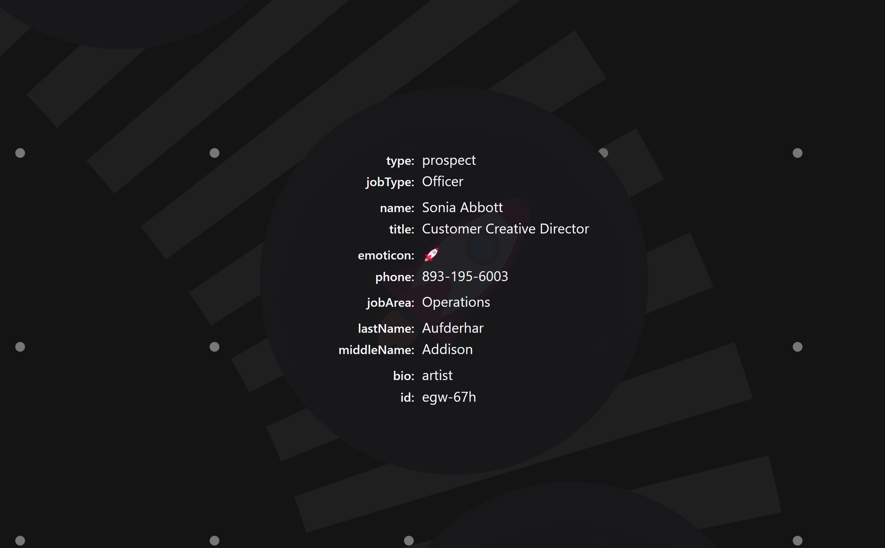

From up close you can see all the details it carries.

This is useful when you want to check if the item is what you expect it to be,
and if it is in the right place at the right time.

# Signal wires 🧵

All corners of Agent Flow entities have little "feet" or "bumpers" on them.

These are the signal ports, and they are used to connect entities to each other
with signal wires.

You can connect them in any way you find most aesthetically pleasing or
practical, because all signal wires are the same.

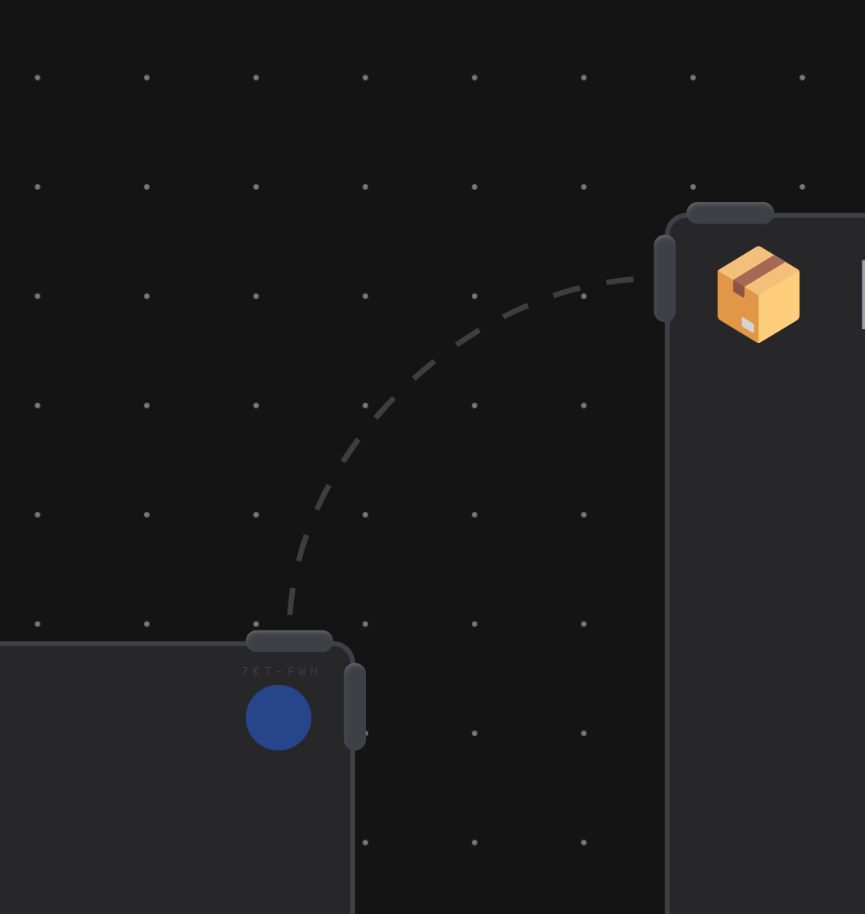

These wires are used to transfer information between entities, allowing you to
connect them in many different ways.

No connection is special and all signal wires are the same, they just share data
from one entity to another.

One of the primary use cases of signal wires is to connect entry and exit
portals to share data between them, allowing you to teleport items between
different parts of your flow.

# Thinking in portals 🔗

Portals allow you to connect different parts of your flow, enabling data to
teleport between them in any amount you deem necessary.

We need to keep in mind some fundamental facts about portals, to be able to use
them to our advantage:

- Portals come in two flavors: entry and exit.
- Entry portals dematerialize items and send their data on signal wires.
- Exit portals receive data from signal wires and materialize items from it.
- Each incoming signal will create a new item.
- Items can not move through portals, only their data gets to the signal wires.
- Signal wires move the data between portals.

Chapters below describe more tricks and tips on how to use portals effectively
in specific situations.

## Entry portals 📥🔗

Entry portals receive items from belts via the inbox port on the top.

### Emit and recycle

Entry portals will dematerialize any item that enters them after converting it
into pure information.

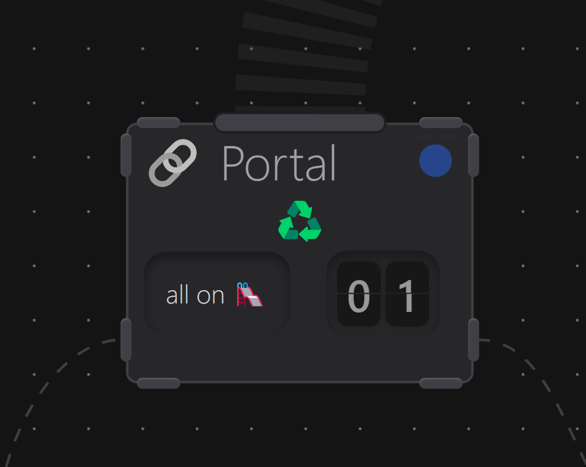

- incoming item gets converted to the data on signal wires
- signal wires transfer data out
- item is recycled and disappears

### Black hole

If you do not connect the portal's signal wires out to anything, the data will
never be used to create a new item. When used like this entry portals are
considered as a black hole or `/dev/null` for any item sent to them.

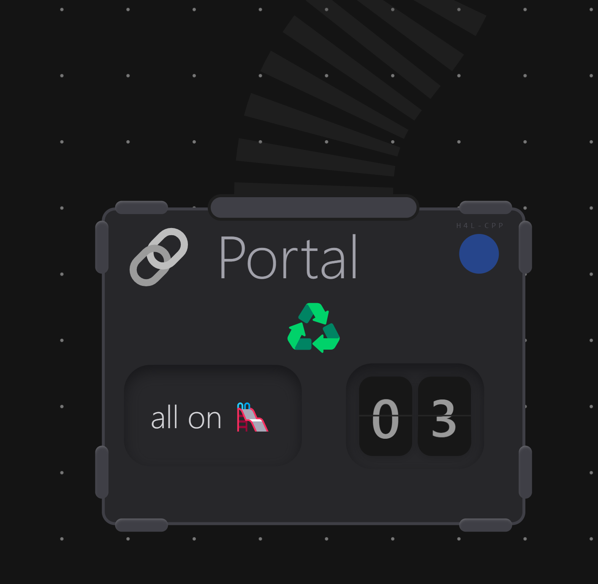

In other words, they will simply remove any items you see no more use for in
your system.

- no signal going out to exit portal = no new item created
- item is still recycled and disappears

### Multiple inputs

More than one belt can be feeding an entry portal.

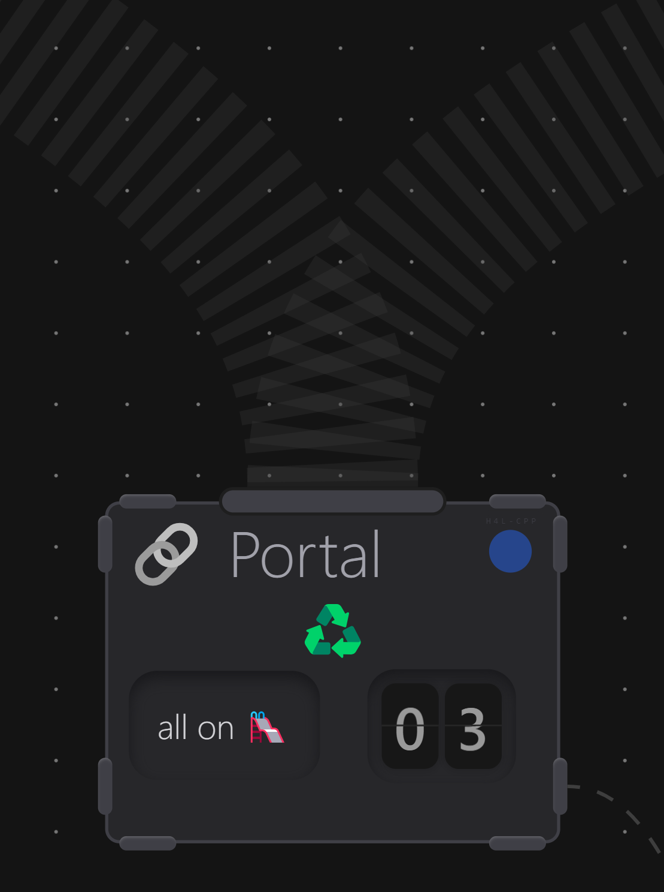

In this way we can use one signal wire to transfer data from multiple belts to
the next part of the flow far away where our exit portal is located, in effect
compressing many belts to a single signal wire.

- multiple belts in
- all information merged in outgoing signal wire
- all items recycled and disappear

## Exit portals 🔗📤

Exit portals release items on the outbox belt at the bottom.

Exit portals will always materialize items from the data they receive on their
signal wires immediately when the signal appears, for each signal wire
connected.

### Cloning data, not moving items

Exit portals will clone (not receive the item, clone it from the signal data,
read this again) any data they see on their signal inputs.

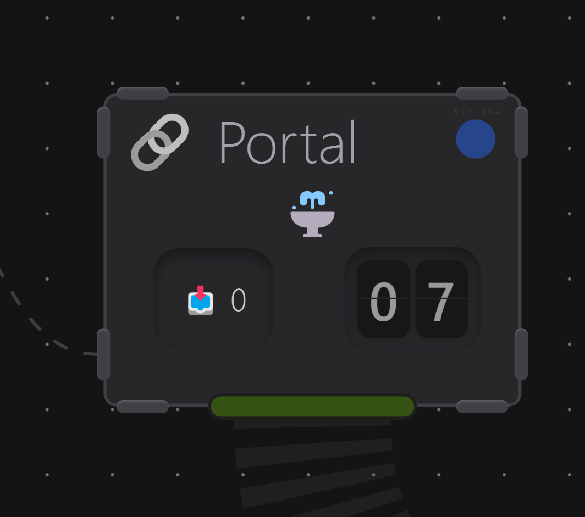

When signal from entry portal is sent to multiple exit portals (with multiple
signal wires), each exit portal will see the same data at the same time.

This will create multiple copies of the same data - one for each signal wire
connected.

Exit portals do not care about other portals, they just do their job: data comes
in, new item comes out.

- when signal appears, new item is instantly queued to be created from the data
- new item will contain the same data as received on the signal wire
- new item will **not** be the specific item which arrived on belt into the
  entry portal (incoming item dematerialized and is gone)
- all items are released as new items on the outbox belt when timer hits zero

### Multiple clones from same entry portal

All signal emissions are handled equally, even when we have more than one
incoming signal wire connected from the same entry portal to the same exit
portal.

This trick can be used by connecting entry to exit portal two times, to cause
double signal coming out of the exit portal, doubling the items produced.

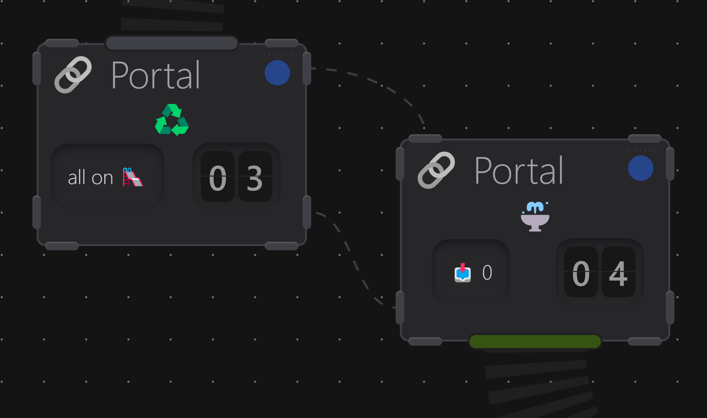

Exit portal wired with two signal wires will be creating two copies each time an
item enters the entry portal, becoming a duplicator.

Entry portal:

- one item comes in
- two signals go out
- incoming item gets dematerialized

Exit portal:

- two signals come in
- two items get queued to be created
- two items come out

---

#### Systems thinking 🧠

We arrived at an example of a simple system which can be easily copied around to
achieve the desired result:

- one item comes in
- two items come out

This is called **_systems thinking_**, and it is a powerful tool to have in your
belt when designing complex systems:

When you see a system like this, you can name it (for example a Doubler could be
used here) and then use it by that name in your toolbox to solve similar
problems in the future.

Now each time you want to get two of the single item you have, just pull out the
Doubler from your toolbox, problem solved.

This way of thinking allows you to break down the problem into its simplest
parts, solve them one by one, and then combine them back together to achieve the
desired result.

Here all we care about are the three mandatory parts of the puzzle:

1. item goes in
2. ✨ implementation details 🪄
3. item comes out

When the 2. exists and works in a predictable way , we can blindly copy it
around and always convert the same input to the same output, without reinventing
the wheel every time.

---

### Multiple incoming signals

Exit portals can receive data from multiple signal wires from different entry
portals.

This means that you can connect multiple entry portals to the same exit portal,
allowing you to merge data from different sources coming from different
directions, cleaning up a visual mess of many intersecting belts.

In effect it works identically to the multiple incoming signals from the same
entry portal in last example, just that the sources of the signals come from
different places.

### Constipated exit portal

If the exit portal is not connected to any belt, it will keep collecting data
but never have a chance to materialize it into items.

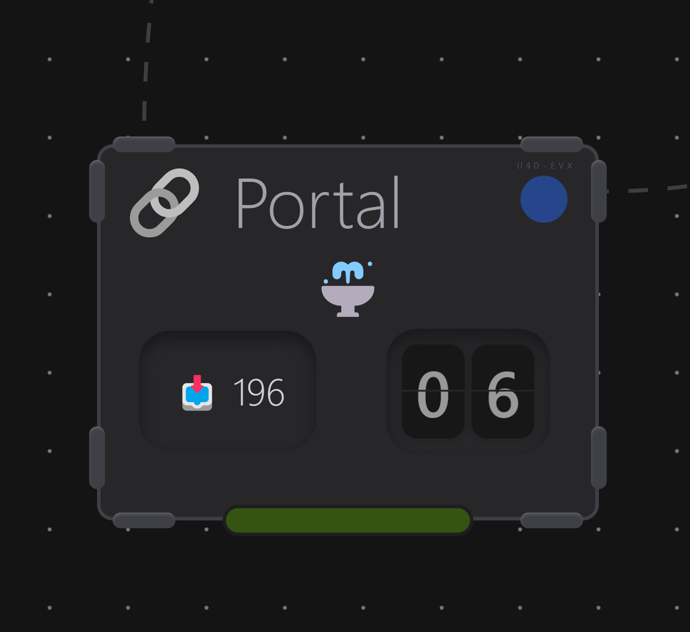

This will be visible as the increasing number of items on the exit portal's item
counter, which will keep growing indefinitely until you connect a belt to it.

### Send and receive - the hidden cost of one-to-one portals ⚠️

One to one entry-exit portals feel like the most straightforward type of portal.
They will send any data they receive on their input signal to their output
signal, replacing a belt with a signal wire.

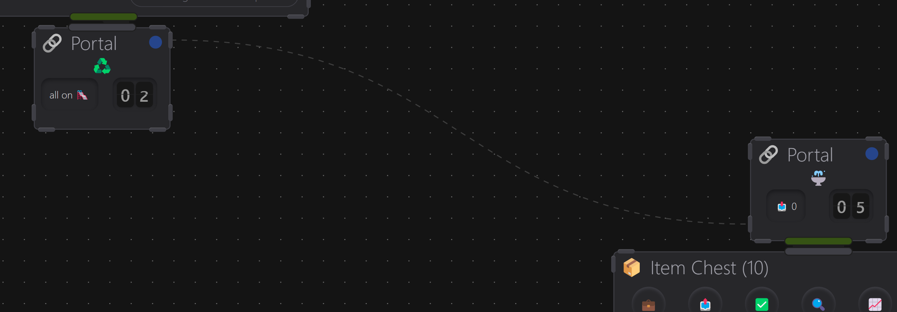

When your item is moved via portal's signal wire - data will disappear from the
belt - replaced by a thin signal wire, and move at the speed of light.

Perfect invention, right?

Please be aware of the major cost in not waiting for the belt to move the data,
designing the system to actively hide the reality from you:

**_There is no observability in a wire:_**

- It looks the same when empty or full.
- It looks the same when congested or barely used.
- _You can not learn from what you can not see._

Contrast this to a situation when you are thirsty and you go to the kitchen to
pour yourself a glass of water. When you open the tap, nothing comes out.

Why did you go to the kitchen? To get a glass of water. And why did you open the
tap? To get the water out. Why, then, did you not get the water?

This is the observability in action: from limited information you had, you
thought you would get water, but you did not. You can not solve the issue if you
did not know it existed in the first place. Now you need to backtrace, "taking
out the fires" and solving problems at the last minute, as they could not be
predicted or prevented in advance.

Metal water pipe is (even when outside the wall) like a signal wire - not
transparent - which is the reason why you could not know you will not get water
until you opened the tap and saw it for yourself.

Contrasting the same situation with the vending machine as the water source, you
would always be sure when water bottle (items) are available, as you can see the
bottles inside, and you can also expect they will all run out, as you can see
the machine stock getting empty and not being refilled fast enough (learning
from the observed pattern through time).

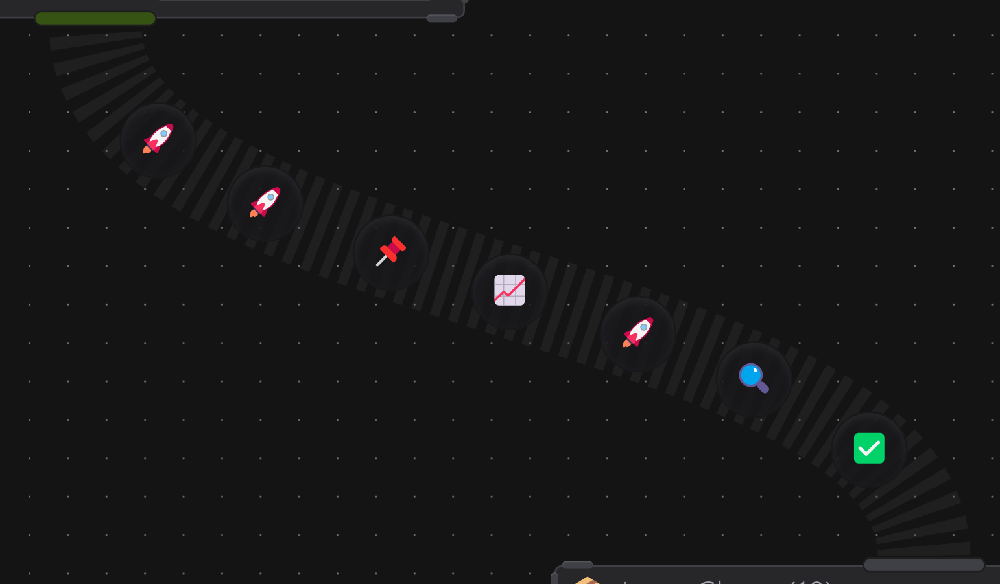

This kind of information asymmetry can cause issues in the long run, as you
could be creating a system that is literally forced to hide things from you,
creating something commonly referred to as a black box.

Wouldn't you prefer to see what is going on inside at all times, to be able to
react to any changes in the system, and prevent any issues before they happen?

Be careful when using portals in this way as a hack to save some time in
transfer. This will take away one of your strongest abilities: to learn from
observation of patterns you see as they happen.

You can always make belts move faster (and speed up the vending machine
refills), but you can not make signal wires (or metal pipes) more observable.

Learning from your lived experience of seeing the actual behavior of the flows
as the data is moving around in your system is a core part of the Agent Flow's
design philosophy.

Observability of the flow allows you to understand the data moving through the
system you created, learning how it behaves and predicting what will happen
next, so you can fine-tune your system to prevent any issues even before they
happen.

This is how you develop an intuition for your system, knowing it deeper and a
lot better than anyone else, while being able to predict its behavior in any
situation - making yourself the most irreplaceable part of the system you
created to work for you, not replace you.

## Portal clock ⏰

Portals run on a loop with a roughly predictable interval.

They display a clock which counts down to the **_estimated_** time of their next
execution.

Upon execution:

- entry portals dematerialize all items on their inbox belt, emitting their data
  on signal wires
- exit portals materialize all collected data as new items on their outbox belt

### Jitter

The estimated time of execution stated on each portal should not be taken as the
precise time when the portal will execute.

Countdown target was calculated at the time of last execution, which can be off
by some % of drift in the time it takes to get to the next execution. This will
cause it to fire only slightly off the target time, but far enough to be noticed
when observed closely.

This was done on purpose as a core design choice of the Agent Flow engine, it is
a feature, not a bug.

All internal clocks are made to be slightly jittery, making portals slowly drift
out of sync even when perfectly aligned at the start with all identical
configurations, loads and conditions placed on them.

This is made to prevent any reliance on unrealistic expectations of timing
perfectionism in the system orchestration design, which is a common pitfall in
many systems, leading to unexpected failures when the system is put even under a
little bit of stress.

Perfection is simply not how real world works and systems naively reliant on
perfect timing are ridiculously brittle and prone to failure in really silly
ways for reasons that are shamefully easy to prevent when approached with a
different mindset.

Systems should be designed to be at least superficially resilient to such
challenges.

Proactive thinking in this way will make them more robust and reliable in the
long run when faced with much more complex and unpredictable real-world
situations.

Expect the unexpected, embrace the chaos. One jitter at a time. 🌀
